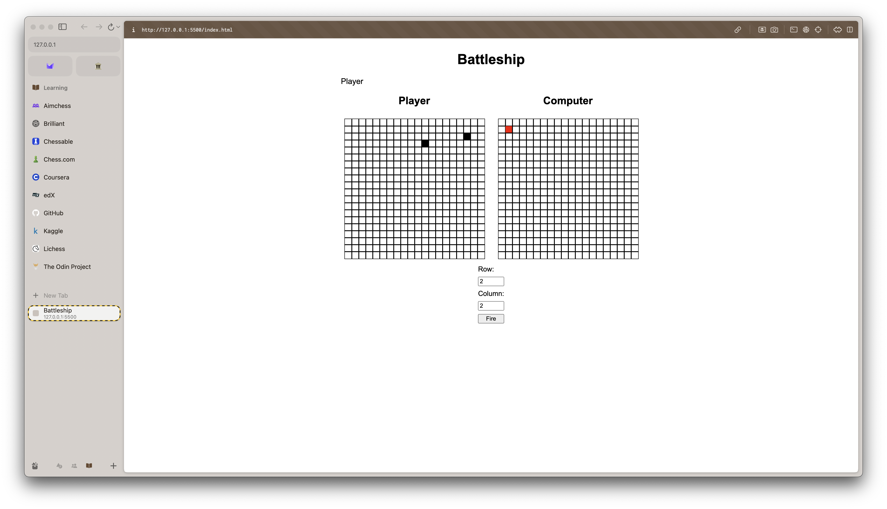

# Battleship

This is an implementation of the classical battleship game.

## Installation and running

The easiest way to install and run the battleship game is by using the Live Server. The prerequisite for this game is a Node.js and NPM installations.

- Install VS Code.
- Install the Live Server extension.
- Clone the repository.
- In the VS Code terminal, run `npm install`.
- Open the index.html file with the Live Server.

## Gameplay

The game is played against computer. First, you have to add your ships by completing the required information in the modal which is shown below . After all the ships are placed, you are brought to the gameplay screen. You have to indicate the coordinates of your move in the modal below the gameboards. A red square on the gameboard indicates that you (or the computer) hit a ship. A black square is a miss. You are alerted when a ship is sunk and when the game is over. The gameplay screen is shown below .

